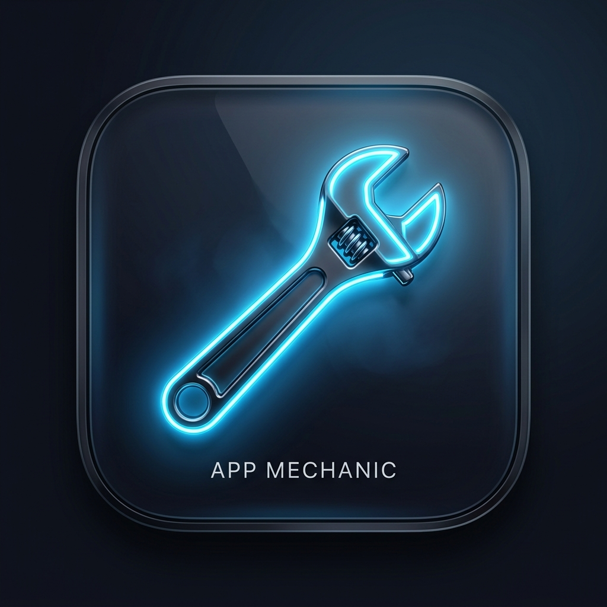

# App Mechanic



App Mechanic is a sleek, zero-dependency macOS utility written in pure Python that scans your installed applications and compares their versions against Homebrew Casks and the Mac App Store to see if they need updating. 

It serves a beautiful, glassmorphic dark-mode dashboard directly on your local machine so you can see the status of all your apps at a glance.

## Prerequisites & Dependencies
App Mechanic leverages two powerful developer tools behind the scenes to check for updates. To get accurate results, you **must** have these installed:

1. **Homebrew**: Used to check the latest versions of standard apps (Chrome, Spotify, OBS, etc.). Install from [brew.sh](https://brew.sh).
2. **mas (Mac App Store command-line interface)**: Used to check the latest versions of App Store apps. Install via Homebrew: `brew install mas`

*(If you don't have these installed, App Mechanic will still run, but it will silently assume all your apps are up to date!)*

## Installation

Because this is a free, open-source tool compiled without an expensive Apple Developer certificate, Apple's "Gatekeeper" security system will try to block it by default. 

### How to Install (The "Hacker" Way)
1. Download the `App Mechanic.zip` file from the Releases page and extract it.
2. Drag `App Mechanic.app` into your `/Applications` folder.
3. Open your Terminal application and run the following command to strip Apple's quarantine flag:
   ```bash
   xattr -cr /Applications/App\ Mechanic.app
   ```
4. You can now double-click `App Mechanic.app` to launch it safely!

*(Alternatively, you can Right-Click the app in Finder, select "Open", and click through the security warning).*

## How It Works
App Mechanic behaves like a native single-instance macOS app. When you double-click it, it runs entirely in the background and automatically opens `http://localhost:8000` in your default web browser to show you the dashboard.

If you close the browser tab, the background server continues to run. If you double click the `.app` again, it will simply re-open your browser to the existing dashboard instantly. To completely shut down the background scanner, just click the **Quit** button on the dashboard UI.

## License & Disclaimer
This software is provided under the **MIT License** by Lieder Digital, LLC.

**WARNING:** This software comes with **ABSOLUTELY NO WARRANTIES WHATSOEVER**. Lieder Digital, LLC is not responsible if this software breaks your computer, deletes your email address and password, drains your bank account, or kidnaps your wife. Use at your own extreme risk! See the `LICENSE` file for more details.
